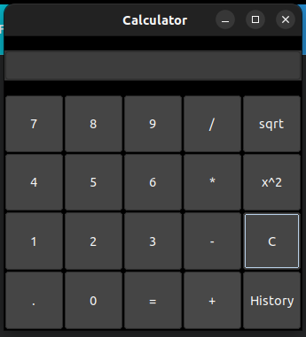

# C# Calculator Application with SQL Server



This repository contains the source code and setup instructions for a C# calculator application with Microsoft SQL Server integration on Ubuntu 22.04.

## Project Demo

Watch the [project demo](https://drive.google.com/file/d/1rXH4i1_psb1MCHkFVV80cg9d0h1U3Lin/view).

## Tools Used

- **C#**: The programming language used for the application.
- **MonoDevelop**: An integrated development environment used to develop the application on Ubuntu.
- **Microsoft SQL Server**: The database server used to store the calculator operations.
- **Azure SQL Database**: Azure cloud database service used for database hosting and management.
- **GTK#**: Used for creating the graphical user interface (GUI) of the calculator application.

## Installation

### Microsoft SQL Server and SQL Server Management Studio

To install Microsoft SQL Server, follow the steps in the [official documentation](https://learn.microsoft.com/en-us/sql/linux/quickstart-install-connect-ubuntu?view=sql-server-ver16&tabs=ubuntu2004).

### MonoDevelop on Ubuntu

Since Visual Studio is not natively available on Ubuntu, MonoDevelop is used as an alternative. To install MonoDevelop:

1. Update the package list and install the required packages:
    ```sh
    sudo apt update
    sudo apt install monodevelop
    ```
     Install MonoDevelop using the following commands given [here](https://www.mono-project.com/download/stable/#download-lin).

2. Open the `calculatorD.sln` solution file in MonoDevelop.

## Calculator Application

The GUI-based calculator application is implemented in C# using MonoDevelop with the following features:
1. Addition
2. Subtraction
3. Multiplication
4. Division
5. Square
6. Square Root
7. History
## Running the Application

1. Clone this repository to your local machine:
    ```sh
    git clone https://github.com/TazmeenAfroz/C-Calculator-Application.git
    cd C-Calculator-Application
    ```

2. Open the solution file `calculatorD.sln` in MonoDevelop:
    ```sh
    monodevelop C-Calculator-Application/calculatorD.sln
    ```

3. Build and run the application from MonoDevelop.

## Database Setup

A database named `CalculatorDB` was created using SQL Server. Tables were created for each operation:

- Addition table
- Subtraction table
- Multiplication table
- Division table
- Square table
- SquareRoot table

Restoring the Database

To restore the database from the backup file CalculatorDB-202442-13-29-9.bak:

    Upload the backup file to your Azure SQL Database storage or local SQL Server.
    Use SQL Server Management Studio (SSMS) or any SQL client to run the following command:
```sql
RESTORE DATABASE CalculatorDB FROM DISK = 'path_to_backup_file\CalculatorDB-202442-13-29-9.bak' WITH REPLACE;
```
Connecting to Azure SQL Database

    Update the connection string in your C# application to connect to the Azure SQL Database. Example:
```sql
string connectionString = "Server=tcp:yourserver.database.windows.net,1433;Initial Catalog=CalculatorDB;Persist Security Info=False;User ID=yourusername;Password=yourpassword;MultipleActiveResultSets=False;Encrypt=True;TrustServerCertificate=False;Connection Timeout=30;";
```
Conclusion

The setup and implementation of the C# calculator application with SQL Server integration on Ubuntu 22.04 were successful. The application allows users to perform various mathematical operations through a user-friendly GUI interface.
License

This project is licensed under the MIT License.

